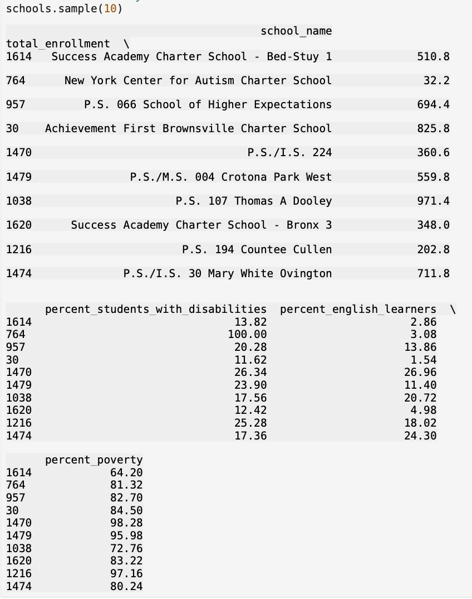
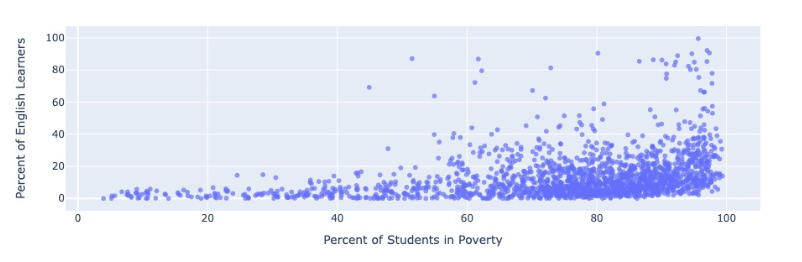
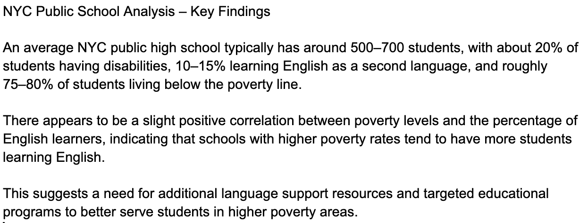

# NYC Public School Data Analysis

Data analysis of NYC public school performance and student demographics using Python, pandas, and data visualization.

---

## Overview

This project explores key trends in NYC public school data, focusing on enrollment, poverty levels, disability rates, and English language learners. The goal is to identify patterns in student populations and understand how socioeconomic factors impact schools.

---

## Tools Used

- Python  
- pandas  
- Matplotlib / Seaborn  
- Jupyter Notebook  

---

## Data Sample

Preview of the dataset used for analysis:

---

## Poverty Distribution

Distribution of students living below the poverty line across schools:

---

## Poverty vs English Learners

Scatter plot showing relationship between poverty levels and percentage of English learners:

---

## Key Findings

- An average NYC public high school typically has around **500–700 students**
- About **20% of students have disabilities**
- Approximately **10–15% are English language learners**
- Roughly **75–80% of students live below the poverty line**
- There is a **slight positive correlation** between poverty levels and English learners
- Schools in higher poverty areas may require **additional language support resources**

---

## Business Interpretation

After analyzing visitor behavior, engagement metrics, and demographic data for NYC public schools, clear patterns emerge. Schools with higher poverty rates tend to have more English learners, suggesting overlapping challenges in underserved communities.

These findings highlight the need for targeted educational support, particularly in language assistance programs, to better serve students in high-poverty areas.

---

## Project File

- `M6_NYC_Schools.ipynb` — Full analysis and code

---

## Author

Jacob Bargeron  
Cyber Engineering Student — University of Arizona  
Aspiring Cybersecurity / Data Analyst
